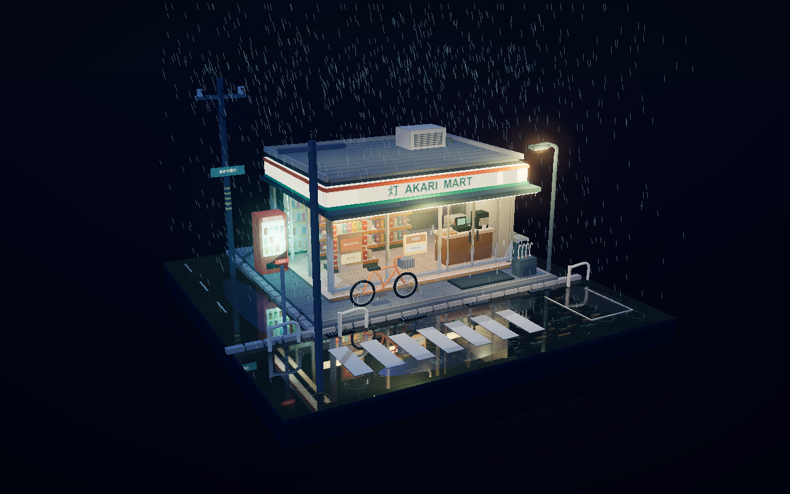
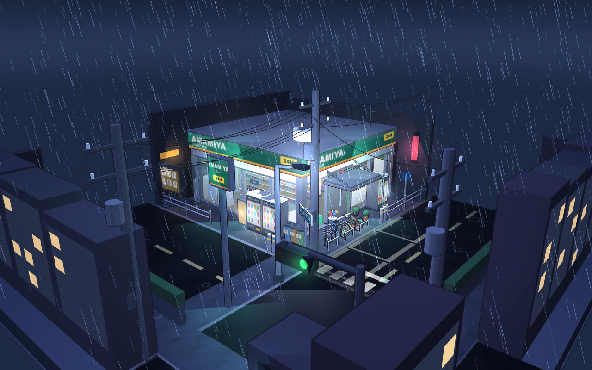
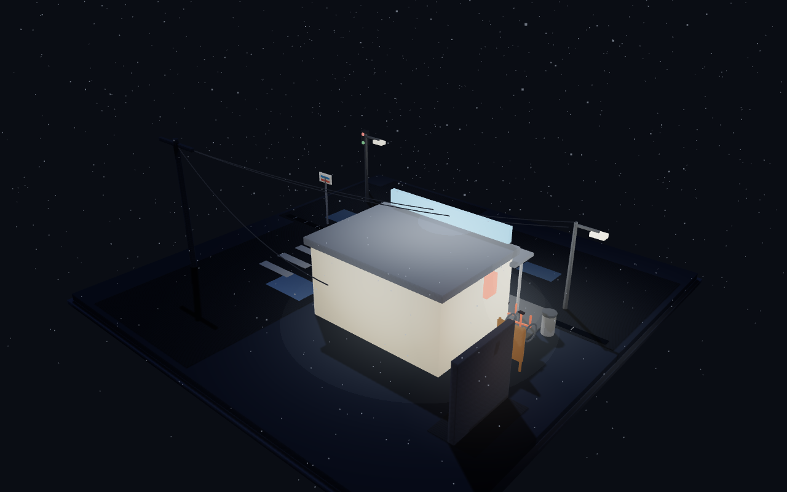

# 711 Night · 雨夜便利店场景集

不同模型基于同一主题制作的日式雨夜便利店三维场景。在线入口会展示全部作品，并支持进入单独页面查看与操作。

在线预览：[场景总览](https://ptsfdtz.github.io/711-night/)

## 作品预览

<table>
  <tr>
    <td width="50%" valign="top">
      <a href="https://ptsfdtz.github.io/711-night/codex/"></a><br>
      <b>Codex</b> · <a href="https://ptsfdtz.github.io/711-night/codex/">打开互动场景</a>
    </td>
    <td width="50%" valign="top">
      <a href="https://ptsfdtz.github.io/711-night/deepseek/"></a><br>
      <b>DeepSeek</b> · <a href="https://ptsfdtz.github.io/711-night/deepseek/">打开互动场景</a>
    </td>
  </tr>
  <tr>
    <td valign="top">
      <a href="https://ptsfdtz.github.io/711-night/MiMo/"></a><br>
      <b>MiMo</b> · <a href="https://ptsfdtz.github.io/711-night/MiMo/">打开互动场景</a>
    </td>
    <td valign="top">
      <a href="https://ptsfdtz.github.io/711-night/Muse_Spark/"></a><br>
      <b>Muse Spark</b> · <a href="https://ptsfdtz.github.io/711-night/Muse_Spark/">打开互动场景</a>
    </td>
  </tr>
  <tr>
    <td width="50%" valign="top">
      <a href="https://ptsfdtz.github.io/711-night/qwen3.6-flash/"></a><br>
      <b>Qwen 3.6 Flash</b> · <a href="https://ptsfdtz.github.io/711-night/qwen3.6-flash/">打开互动场景</a>
    </td>
    <td width="50%" valign="top">
      <b>Ling 3.0 Flash</b> · <a href="https://ptsfdtz.github.io/711-night/Ling3.0-flash/">打开互动场景</a>
    </td>
  </tr>
  <tr>
    <td valign="top">
      <b>MiniMax M3</b> · <a href="https://ptsfdtz.github.io/711-night/MiniMax-M3/">打开互动场景</a>
    </td>
    <td valign="top">
      <b>Nemotron 3.5 Lightning</b> · <a href="https://ptsfdtz.github.io/711-night/Nemotron3.5Lightning/">打开互动场景</a>
    </td>
  </tr>
</table>

## 目录约定

每个作品放在自己的目录中，入口固定为 `目录名/index.html`。预览图统一放在 `docs/previews/`，并以目录的稳定小写名称命名。

```text
新模型目录/
  index.html
docs/previews/
  新模型目录的小写名称.png
```

## 添加新模型

1. 新建模型目录，并提供可独立打开的 `index.html`。
2. 在根目录 `index.html` 的 `pages` 数组中添加模型名称和目录名；它会自动出现在在线总览中。
3. 生成一张 `1280 × 800` 的场景截图，保存到 `docs/previews/`。
4. 复制上方“作品预览”中的一个单元格，替换名称、截图路径和互动场景链接。
5. 提交并推送到 `master`，GitHub Pages 会自动发布。
