# 711 Night · 雨夜便利店场景集

不同模型基于同一主题制作的日式雨夜便利店三维场景。在线入口会展示全部作品，并支持进入单独页面查看与操作。

在线预览：[场景总览](https://ptsfdtz.github.io/711-night/)

> 与主题一起给出的原始提示词见下方 [提示词](#提示词)。

## 作品预览

<table>
  <tr>
    <td width="50%" valign="top">
      <a href="https://ptsfdtz.github.io/711-night/gpt-5.6-terra/">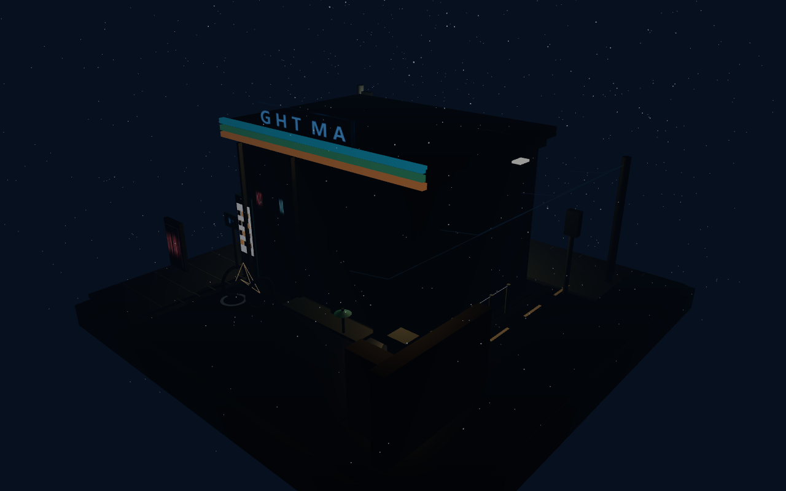</a><br>
      <b>GPT 5.6 Terra</b> · <a href="https://ptsfdtz.github.io/711-night/gpt-5.6-terra/">打开互动场景</a>
    </td>
    <td width="50%" valign="top">
      <a href="https://ptsfdtz.github.io/711-night/gpt-5.6-luna/">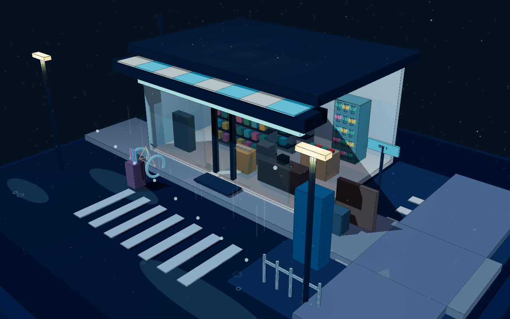</a><br>
      <b>GPT 5.6 Luna</b> · <a href="https://ptsfdtz.github.io/711-night/gpt-5.6-luna/">打开互动场景</a>
    </td>
  </tr>
  <tr>
    <td width="50%" valign="top">
      <a href="https://ptsfdtz.github.io/711-night/gpt-5.6-sol/">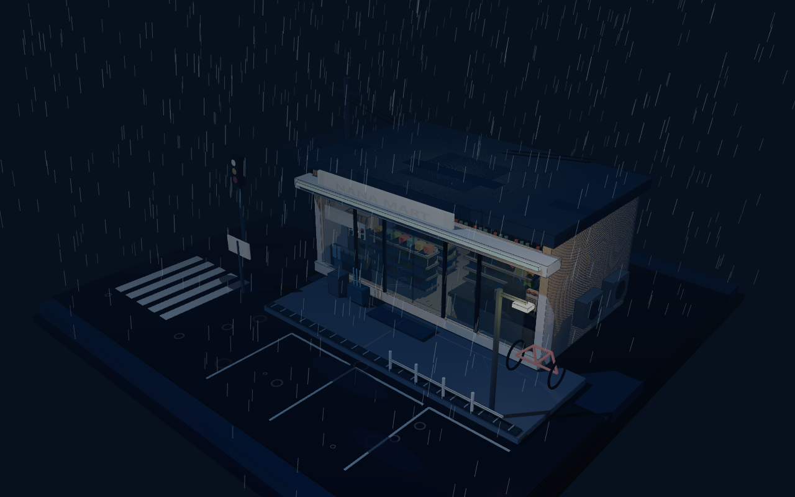</a><br>
      <b>GPT 5.6 Sol</b> · <a href="https://ptsfdtz.github.io/711-night/gpt-5.6-sol/">打开互动场景</a>
    </td>
    <td width="50%" valign="top">
      <a href="https://ptsfdtz.github.io/711-night/gpt-6-astra/">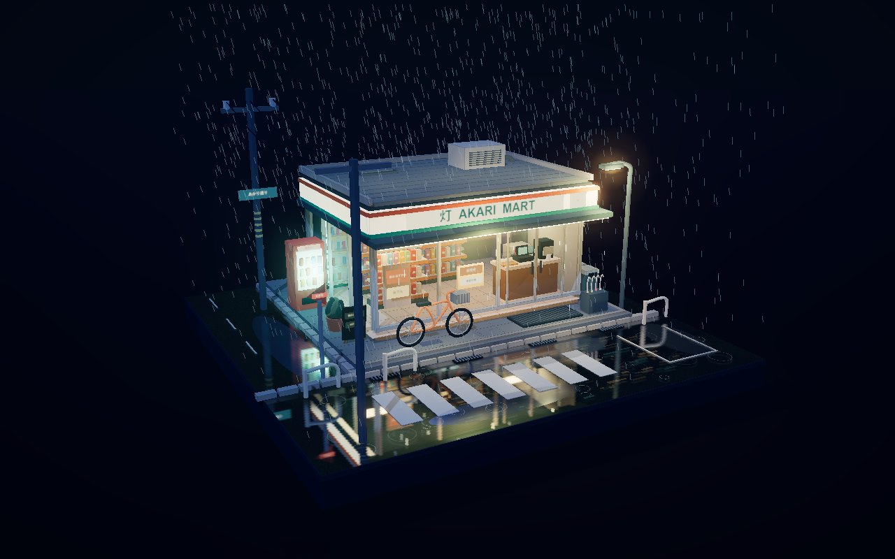</a><br>
      <b>GPT 6 Astra</b> · <a href="https://ptsfdtz.github.io/711-night/gpt-6-astra/">打开互动场景</a>
    </td>
  </tr>
  <tr>
    <td width="50%" valign="top">
      <a href="https://ptsfdtz.github.io/711-night/gpt-6-luna/">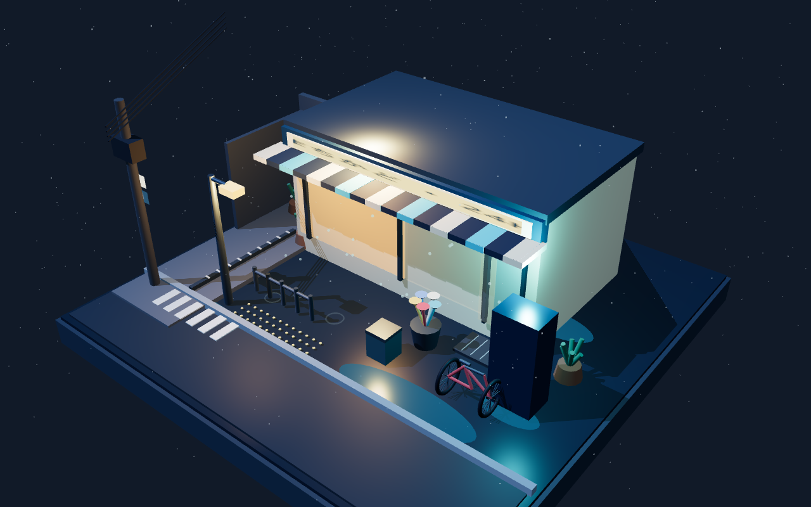</a><br>
      <b>GPT 6 Luna</b> · <a href="https://ptsfdtz.github.io/711-night/gpt-6-luna/">打开互动场景</a>
    </td>
    <td width="50%" valign="top">
      <a href="https://ptsfdtz.github.io/711-night/gpt-6-sol/">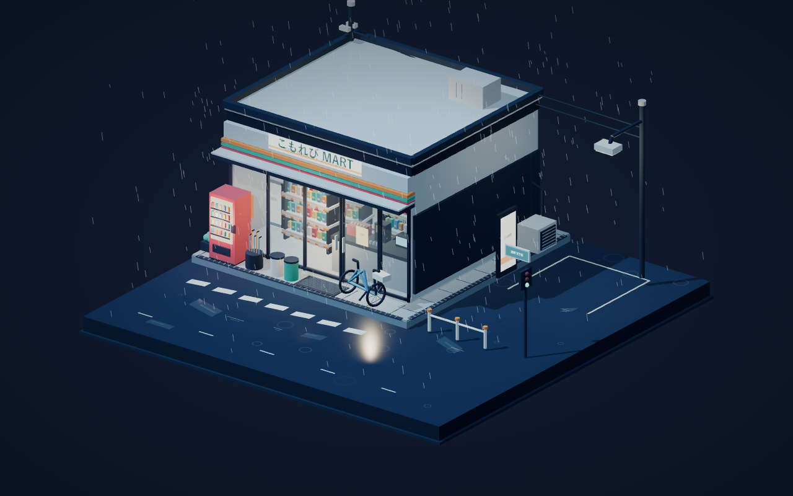</a><br>
      <b>GPT 6 Sol</b> · <a href="https://ptsfdtz.github.io/711-night/gpt-6-sol/">打开互动场景</a>
    </td>
  </tr>
  <tr>
    <td width="50%" valign="top">
      <a href="https://ptsfdtz.github.io/711-night/gpt-6.1-sol/Rainy-Corner.html">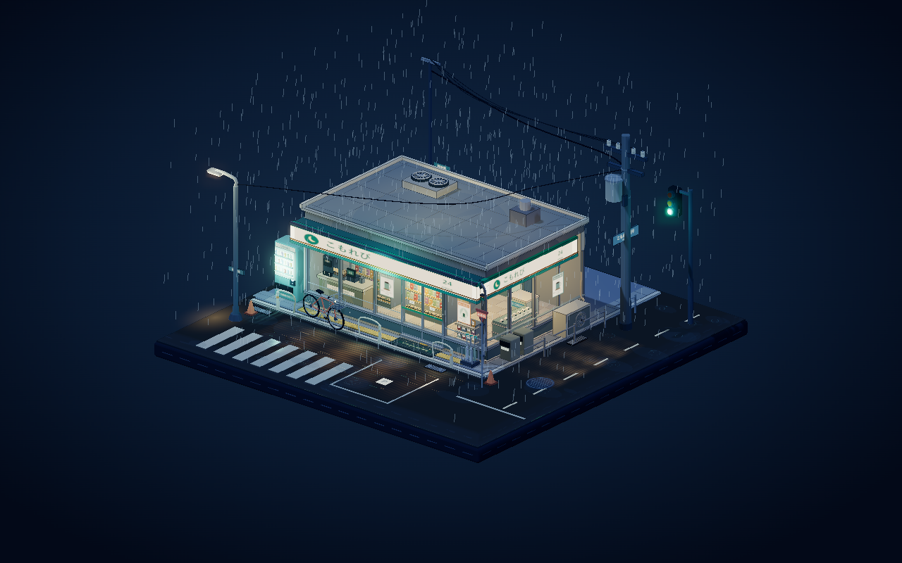</a><br>
      <b>GPT 6.1 Sol</b> · <a href="https://ptsfdtz.github.io/711-night/gpt-6.1-sol/Rainy-Corner.html">打开互动场景</a>
    </td>
    <td width="50%" valign="top">
      <a href="https://ptsfdtz.github.io/711-night/deepseek-v4.1-flash/">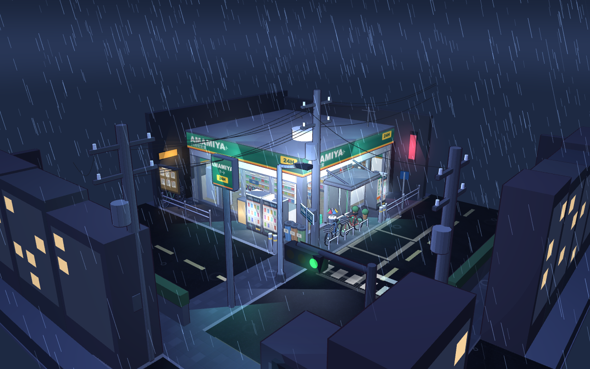</a><br>
      <b>DeepSeek V4.1 Flash</b> · <a href="https://ptsfdtz.github.io/711-night/deepseek-v4.1-flash/">打开互动场景</a>
    </td>
  </tr>
  <tr>
    <td width="50%" valign="top">
      <a href="https://ptsfdtz.github.io/711-night/deepseek-v4-pro/">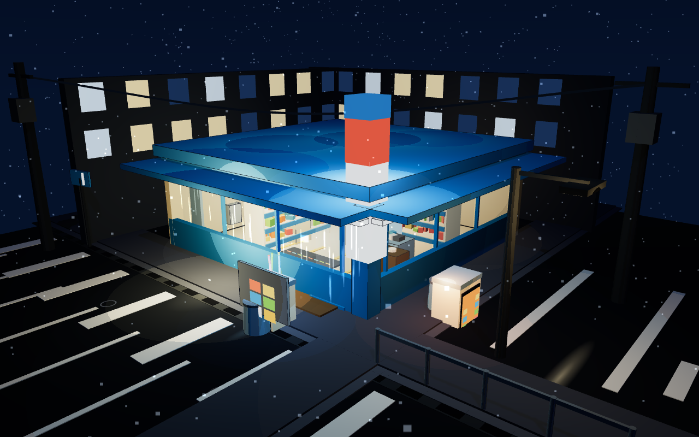</a><br>
      <b>DeepSeek V4 Pro</b> · <a href="https://ptsfdtz.github.io/711-night/deepseek-v4-pro/">打开互动场景</a>
    </td>
    <td width="50%" valign="top">
      <a href="https://ptsfdtz.github.io/711-night/qwen-3.6-flash/">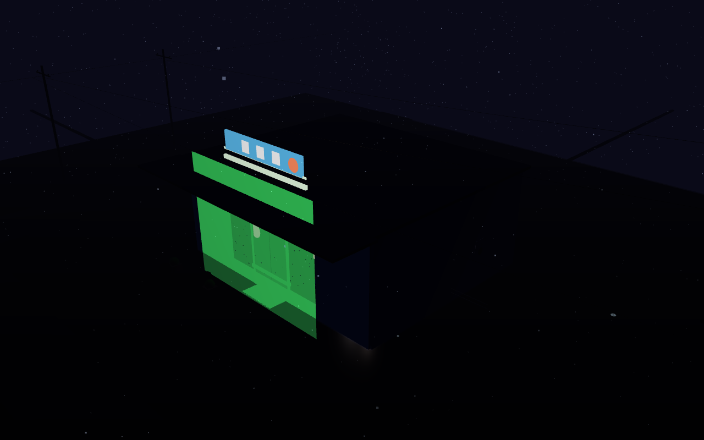</a><br>
      <b>Qwen 3.6 Flash</b> · <a href="https://ptsfdtz.github.io/711-night/qwen-3.6-flash/">打开互动场景</a>
    </td>
  </tr>
  <tr>
    <td width="50%" valign="top">
      <a href="https://ptsfdtz.github.io/711-night/qwen-3.8-flash/">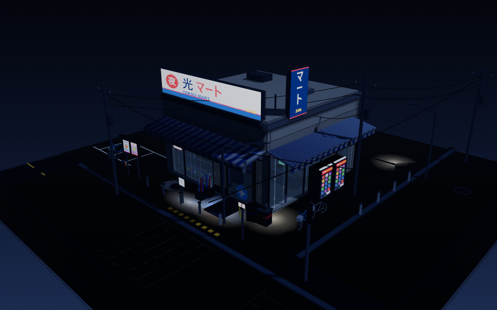</a><br>
      <b>Qwen 3.8 Flash</b> · <a href="https://ptsfdtz.github.io/711-night/qwen-3.8-flash/">打开互动场景</a>
    </td>
    <td width="50%" valign="top">
      <a href="https://ptsfdtz.github.io/711-night/qwen-3.8-27b/">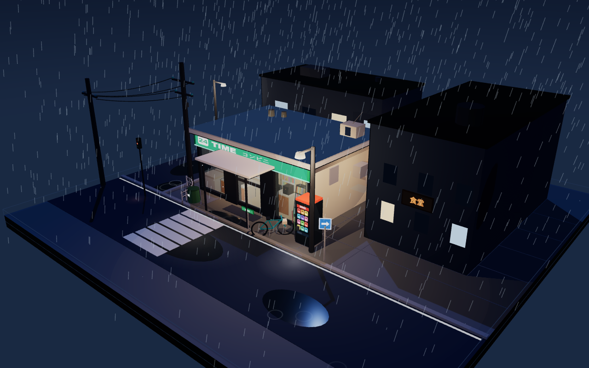</a><br>
      <b>Qwen 3.8 27B</b> · <a href="https://ptsfdtz.github.io/711-night/qwen-3.8-27b/">打开互动场景</a>
    </td>
  </tr>
  <tr>
    <td width="50%" valign="top">
      <a href="https://ptsfdtz.github.io/711-night/qwen-3.8-max/">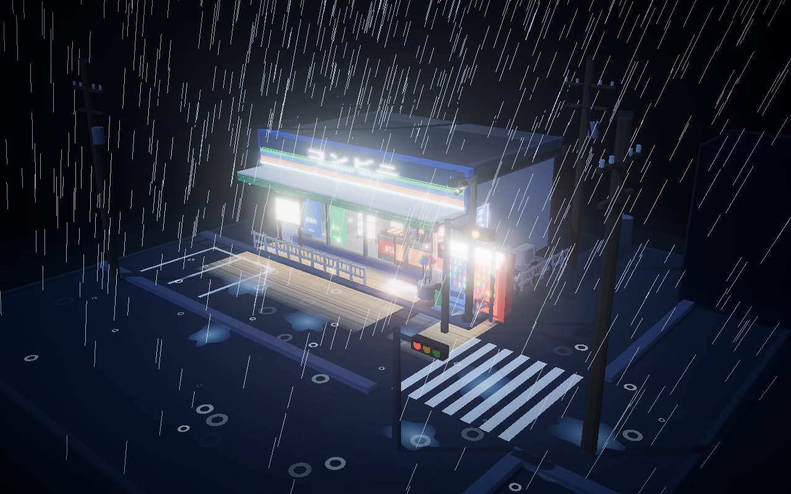</a><br>
      <b>Qwen 3.8 Max</b> · <a href="https://ptsfdtz.github.io/711-night/qwen-3.8-max/">打开互动场景</a>
    </td>
    <td width="50%" valign="top"></td>
  </tr>
  <tr>
    <td width="50%" valign="top">
      <a href="https://ptsfdtz.github.io/711-night/mimo-v2.6-flash/">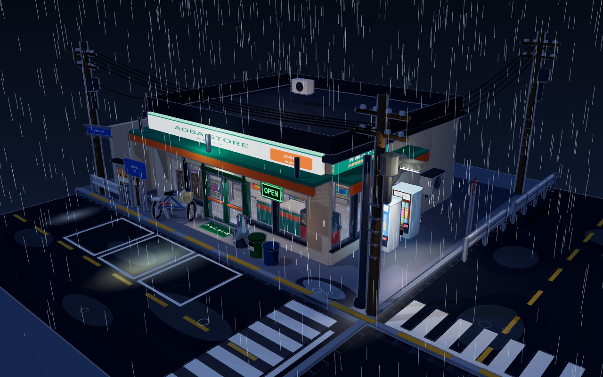</a><br>
      <b>MiMo V2.6 Flash</b> · <a href="https://ptsfdtz.github.io/711-night/mimo-v2.6-flash/">打开互动场景</a>
    </td>
    <td width="50%" valign="top">
      <a href="https://ptsfdtz.github.io/711-night/mimo-v2.6-pro/">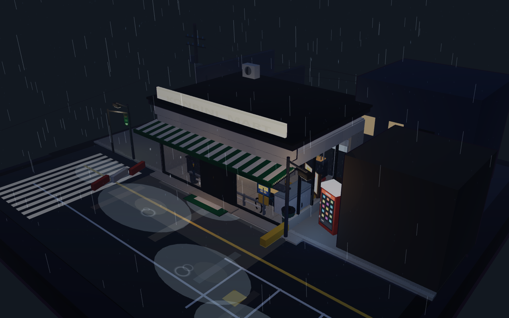</a><br>
      <b>MiMo V2.6 Pro</b> · <a href="https://ptsfdtz.github.io/711-night/mimo-v2.6-pro/">打开互动场景</a>
    </td>
  </tr>
  <tr>
    <td width="50%" valign="top">
      <a href="https://ptsfdtz.github.io/711-night/doubao-2.1/">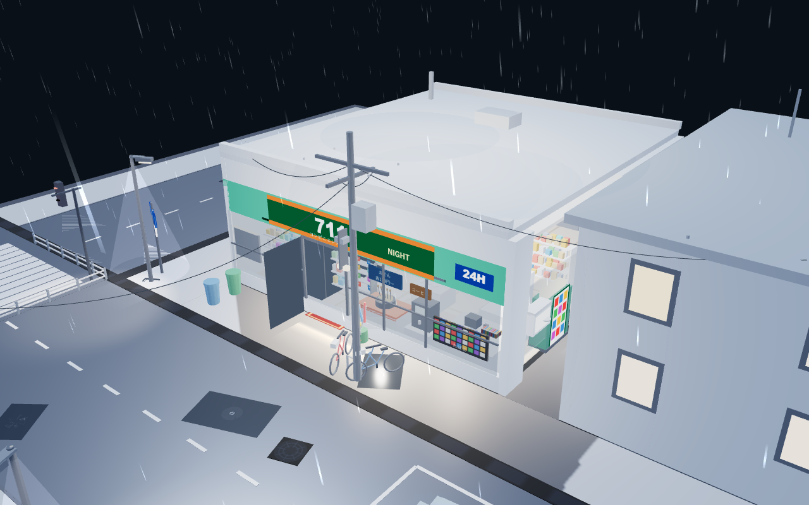</a><br>
      <b>Doubao 2.1</b> · <a href="https://ptsfdtz.github.io/711-night/doubao-2.1/">打开互动场景</a>
    </td>
    <td width="50%" valign="top">
      <a href="https://ptsfdtz.github.io/711-night/glm-5.1/">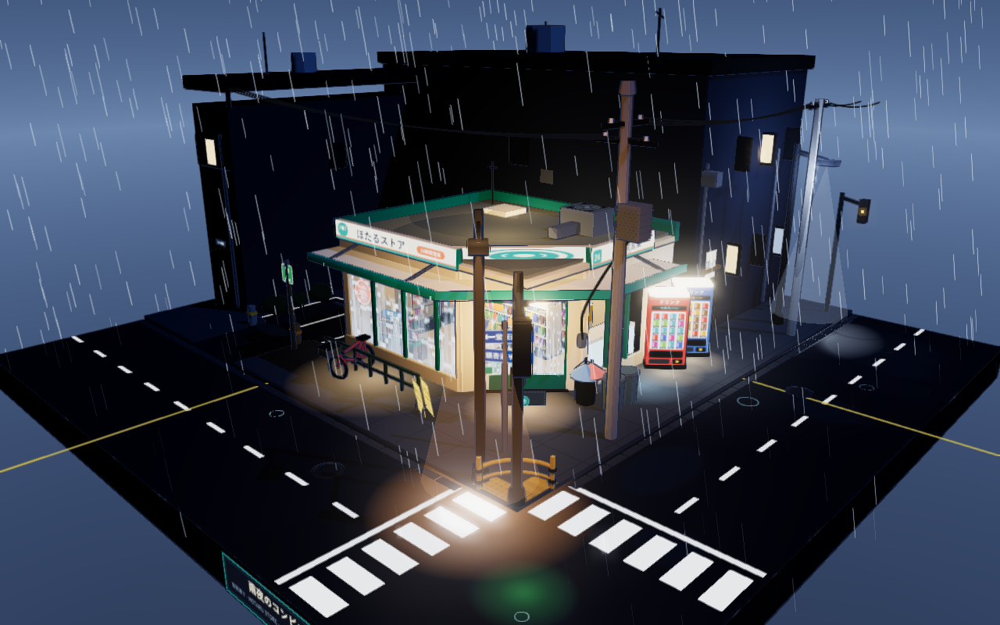</a><br>
      <b>GLM 5.1</b> · <a href="https://ptsfdtz.github.io/711-night/glm-5.1/">打开互动场景</a>
    </td>
  </tr>
  <tr>
    <td width="50%" valign="top">
      <a href="https://ptsfdtz.github.io/711-night/glm-5.3-flash/">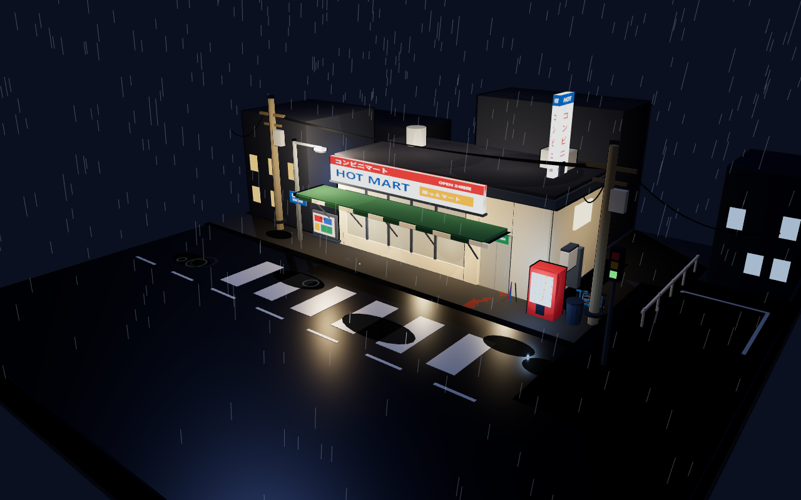</a><br>
      <b>GLM 5.3 Flash</b> · <a href="https://ptsfdtz.github.io/711-night/glm-5.3-flash/">打开互动场景</a>
    </td>
    <td width="50%" valign="top">
      <a href="https://ptsfdtz.github.io/711-night/gemini-3.8-flash/">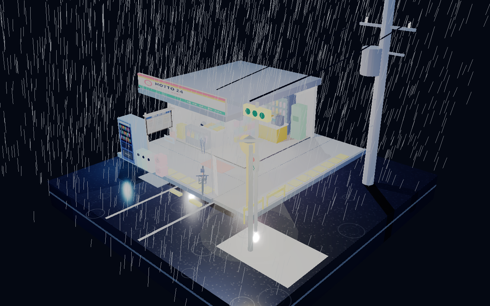</a><br>
      <b>Gemini 3.8 Flash</b> · <a href="https://ptsfdtz.github.io/711-night/gemini-3.8-flash/">打开互动场景</a>
    </td>
  </tr>
  <tr>
    <td width="50%" valign="top">
      <a href="https://ptsfdtz.github.io/711-night/grok-4.7/">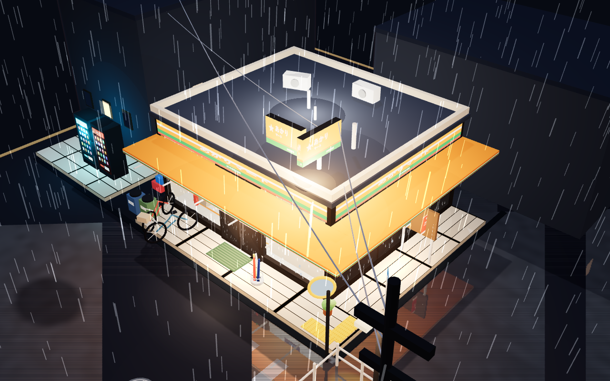</a><br>
      <b>Grok 4.7</b> · <a href="https://ptsfdtz.github.io/711-night/grok-4.7/">打开互动场景</a>
    </td>
    <td width="50%" valign="top">
      <a href="https://ptsfdtz.github.io/711-night/hy4-preview/">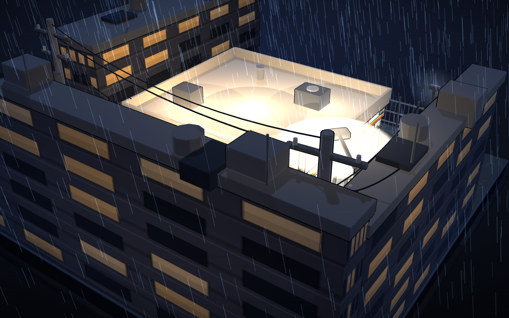</a><br>
      <b>Hy4 Preview</b> · <a href="https://ptsfdtz.github.io/711-night/hy4-preview/">打开互动场景</a>
    </td>
  </tr>
  <tr>
    <td width="50%" valign="top">
      <a href="https://ptsfdtz.github.io/711-night/kimi-k3/">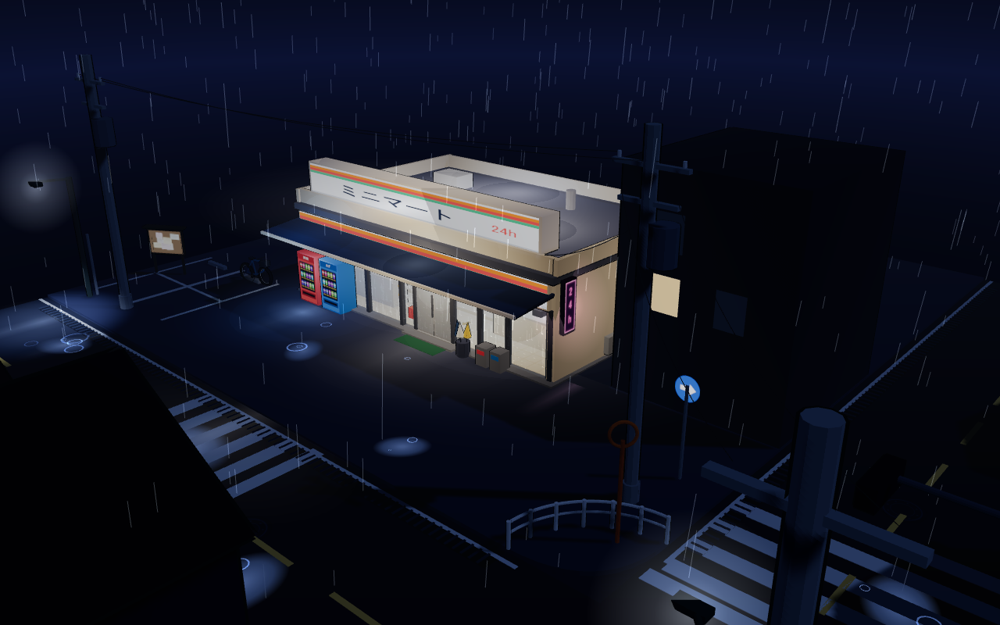</a><br>
      <b>Kimi K3</b> · <a href="https://ptsfdtz.github.io/711-night/kimi-k3/">打开互动场景</a>
    </td>
    <td width="50%" valign="top">
      <a href="https://ptsfdtz.github.io/711-night/ling-3.0-flash/">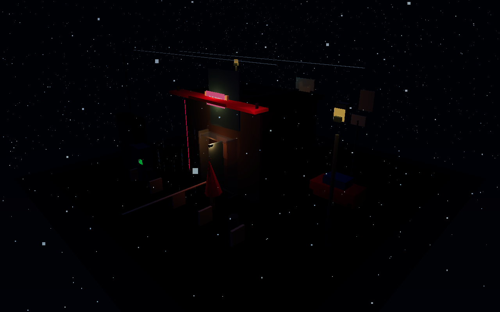</a><br>
      <b>Ling 3.0 Flash</b> · <a href="https://ptsfdtz.github.io/711-night/ling-3.0-flash/">打开互动场景</a>
    </td>
  </tr>
  <tr>
    <td width="50%" valign="top">
      <a href="https://ptsfdtz.github.io/711-night/longcat-2.0/">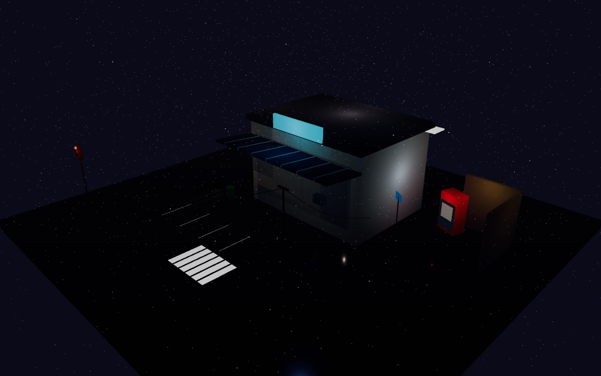</a><br>
      <b>LongCat 2.0</b> · <a href="https://ptsfdtz.github.io/711-night/longcat-2.0/">打开互动场景</a>
    </td>
    <td width="50%" valign="top">
      <a href="https://ptsfdtz.github.io/711-night/minimax-m3/">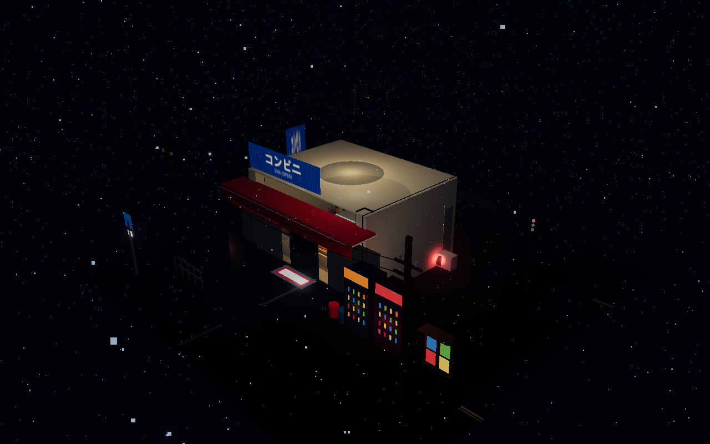</a><br>
      <b>MiniMax M3</b> · <a href="https://ptsfdtz.github.io/711-night/minimax-m3/">打开互动场景</a>
    </td>
  </tr>
  <tr>
    <td width="50%" valign="top">
      <a href="https://ptsfdtz.github.io/711-night/muse-spark-1.3/">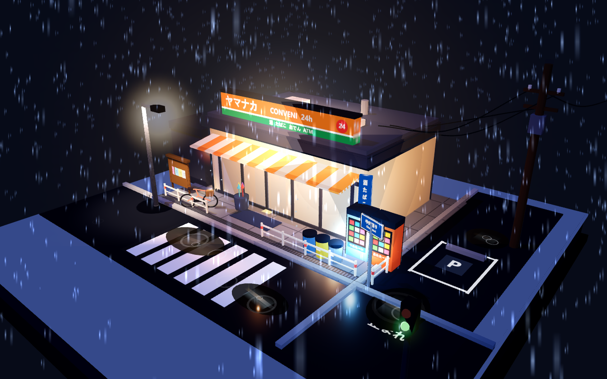</a><br>
      <b>Muse Spark 1.3</b> · <a href="https://ptsfdtz.github.io/711-night/muse-spark-1.3/">打开互动场景</a>
    </td>
    <td width="50%" valign="top">
      <a href="https://ptsfdtz.github.io/711-night/nemotron-3.5-lightning/">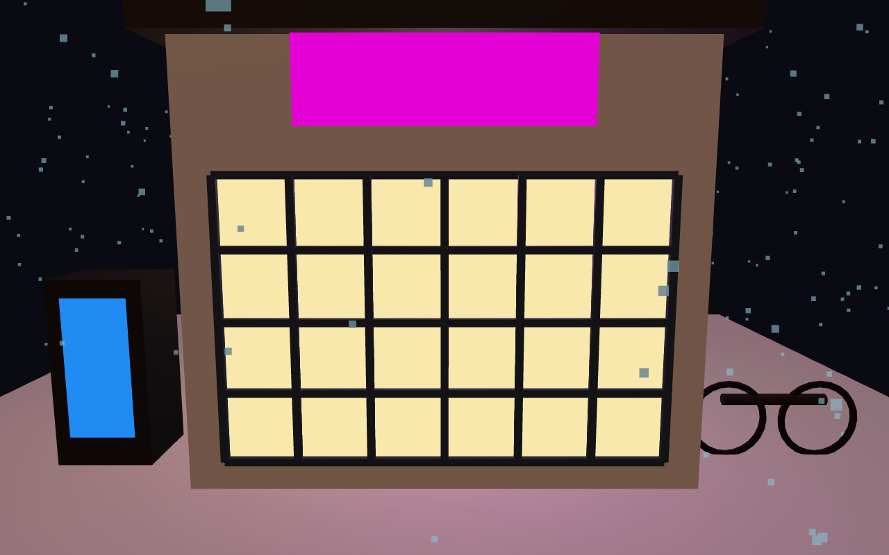</a><br>
      <b>Nemotron 3.5 Lightning</b> · <a href="https://ptsfdtz.github.io/711-night/nemotron-3.5-lightning/">打开互动场景</a>
    </td>
  </tr>
  <tr>
    <td width="50%" valign="top">
      <a href="https://ptsfdtz.github.io/711-night/ClaudeHaiku5.5/">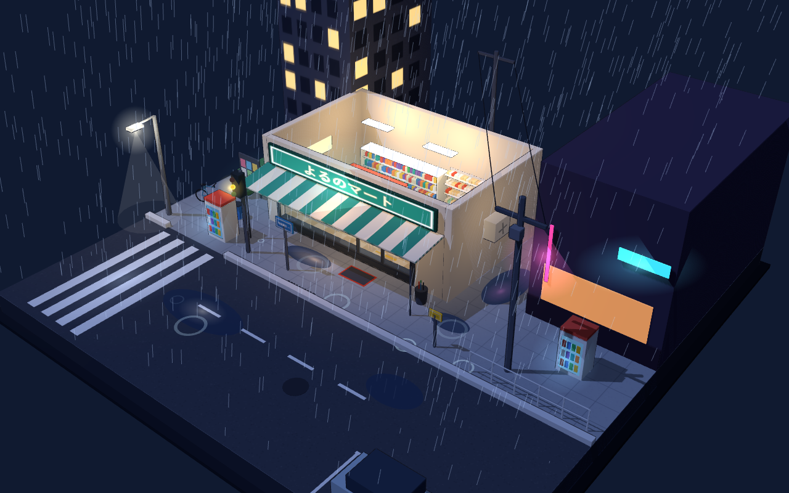</a><br>
      <b>Claude Haiku 5.5</b> · <a href="https://ptsfdtz.github.io/711-night/ClaudeHaiku5.5/">打开互动场景</a>
    </td>
    <td width="50%" valign="top">
      <a href="https://ptsfdtz.github.io/711-night/SpaceBunnyFree/">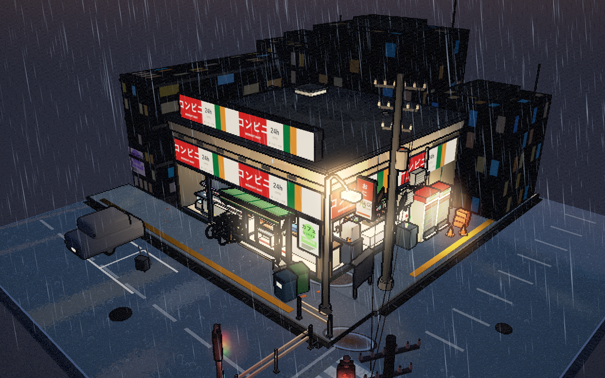</a><br>
      <b>Space Bunny Free</b> · <a href="https://ptsfdtz.github.io/711-night/SpaceBunnyFree/">打开互动场景</a>
    </td>
  </tr>
  <tr>
    <td width="50%" valign="top">
      <a href="https://ptsfdtz.github.io/711-night/claude-fable-5.1/rainy-night-store.html">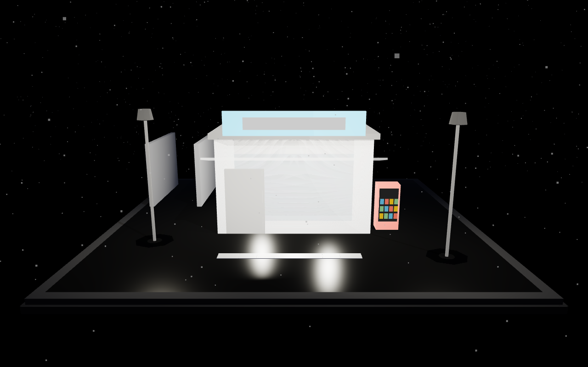</a><br>
      <b>Claude Fable 5.1</b> · <a href="https://ptsfdtz.github.io/711-night/claude-fable-5.1/rainy-night-store.html">打开互动场景</a><br>
      <small>API 来自注水中转站，效果不代表模型实际表现。</small>
    </td>
    <td width="50%" valign="top">
      <a href="https://ptsfdtz.github.io/711-night/claude-opus-5.5/rainy-night-convenience-store.html">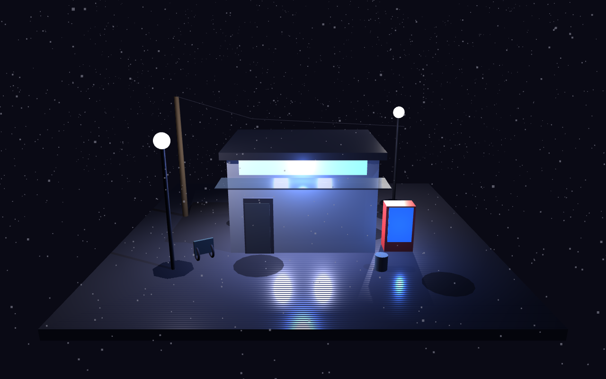</a><br>
      <b>Claude Opus 5.5</b> · <a href="https://ptsfdtz.github.io/711-night/claude-opus-5.5/rainy-night-convenience-store.html">打开互动场景</a><br>
      <small>API 来自注水中转站，效果不代表模型实际表现。</small>
    </td>
  </tr>
  <tr>
    <td width="50%" valign="top">
      <a href="https://ptsfdtz.github.io/711-night/claude-sonnet-5.5/rainy-night-convenience-store.html"></a><br>
      <b>Claude Sonnet 5.5</b> · <a href="https://ptsfdtz.github.io/711-night/claude-sonnet-5.5/rainy-night-convenience-store.html">打开互动场景</a><br>
      <small>API 来自注水中转站，效果不代表模型实际表现。</small>
    </td>
    <td width="50%" valign="top"></td>
  </tr>
</table>

> **API 来源说明：** Claude Fable 5.1、Claude Opus 5.5 和 Claude Sonnet 5.5 使用的 API 来自注水中转站，因此这些场景的产出不代表对应模型的实际效果。

## 提示词

每个模型使用同一段提示词，内容如下：

```text
请制作一个雨夜便利店街角小场景，以第三视角观察整个场景，整体像一个可以自由拖拽、旋转、缩放观看的微缩三维模型 / 小型景观，没有任何UI界面元素。地面为一个完整的正方形底座，所有元素都搭建在这个底座上，构图紧凑、层次清晰，整体呈现出小巧、精致、可收藏的模型感。画面风格为三渲二，强调浓厚的日式二次元动画氛围，材质表现干净，轮廓明确，色彩柔和但富有夜景霓虹的层次感。 场景主体是一处日式便利店街角，便利店位于底座的视觉中心，外部有典型的日式街角元素：便利店招牌、玻璃橱窗、自动门、屋檐雨棚、门口地垫、自动贩卖机、自行车、雨伞架、垃圾桶、路灯、电线杆、电线、路牌、街角护栏、停车位、排水沟、积水路面、反光斑马线、小巷入口、空调外机、小型公告栏或海报栏等。街道不需要太大，但要有明确的街角转折感，像日本动画里常见的夜晚社区一角。 不要人物，但便利店内部一定要有足够内容，并且可以透过大面积玻璃窗清楚看到店内。店内可见典型便利店陈设，例如：整齐排列的货架、饮料柜、便当区、饭团和零食陈列、收银台、咖啡机、杂志架、宣传海报、店内灯箱、冰柜、关东煮柜台、地面导视、储物柜或后场门等。要让便利店内部显得明亮、温暖、真实、充实，与室外潮湿昏暗的雨夜形成鲜明对比，营造出非常典型的日式动画雨夜氛围。 美术风格重点强调：高精细建模、三渲二卡通渲染、清晰的轮廓线、细腻但简洁的材质层次、湿润的夜景反光、暖色室内灯光与冷色雨夜街景对比、浓厚的二次元日常场景感。整体气质应偏向安静、治愈、带一点都市夜晚孤独感但依然温暖，像一幕被定格下来的日本动画街角场景模型。 加入一些基础动效来增强生命力：持续降雨、屋檐滴水、地面积水波纹、便利店招牌或灯箱轻微闪烁、自动门偶尔开合、雨水沿玻璃滑落、街道路面积水反射灯光、远处交通信号灯微弱变化等。整体效果应像一个静止而精致的三维微缩世界，但带有恰到好处的细微动态，突出其三渲二、二次元、雨夜、便利店、街角、小巧精致的核心特征。
```

## 目录约定

每个作品放在自己的目录中，目录名原则上使用小写短横线格式，并与模型显示名对应（如 `gpt-6.1-sol` 对应 GPT 6.1 Sol）。通常以 `目录名/index.html` 为入口；独立打包的作品也可指向目录内的其他 HTML 文件。预览图统一放在 `docs/previews/`，并以目录名的小写形式命名。

```text
新模型目录/
  index.html
docs/previews/
  新模型目录名.png
```

- 场景尽量自包含：要么把 three.js 等依赖放进自己的 `vendor/`、`lib/`，用 import map 指向本地，要么使用稳定的 CDN。只有 `index.html` 与所需资源会随仓库一起发布。
- `node_modules/`、`.browsers/`、`package-lock.json`、`verify.cjs`、本地截图 `preview*.png` 均不会上传，提交前无需手动清理。

## 添加新模型（PR 流程）

1. Fork 本仓库并新建分支。
2. 新建 `模型目录/index.html`，保证可独立打开；本地预览可在仓库根目录运行 `python -m http.server 18990 --bind 127.0.0.1`，浏览器访问 `http://127.0.0.1:18990/模型目录/`。
3. 在根目录 `index.html` 的 `pages` 数组中添加 `{ name: "显示名", dir: "模型目录" }`，它会自动出现在在线总览中。
4. 生成预览图（见下方[预览截图工具](#预览截图工具)），输出 `docs/previews/<小写目录名>.png`。
5. 在 README「作品预览」表格中复制一个单元格，替换名称、截图路径和互动场景链接。
6. 提交并推送到 `master`，GitHub Pages 会自动发布。

排序约定：总览与预览表格按模型厂商排列，顺序为 GPT、DeepSeek、Qwen、MiMo、Doubao、GLM，其余厂商排在最后。

建议 PR 标题写明模型名（如 `feat: add <模型名> rainy-night scene`），并在描述中附上预览图。

## 预览截图工具

`tools/capture-previews.cjs` 会用 Playwright 无头浏览器批量截取每个场景的 `1280 × 800` 预览图，输出到 `docs/previews/`。

```bash
# 1. 启动本地静态服务器（任选一个）
python -m http.server 18990 --bind 127.0.0.1

# 2. 生成全部预览
node tools/capture-previews.cjs --port 18990

# 也可以只截取某个目录
node tools/capture-previews.cjs --port 18990 gpt-6-astra
```

依赖 Playwright：优先使用仓库内已安装的 `node_modules`，否则回退到 `gpt-6-astra/node_modules`。若都没有，先在本机安装一次：`npm i -D playwright && npx playwright install chromium`。新增作品时，记得把目录加入脚本顶部的 `SCENES` 列表（同样按厂商顺序排列）。
